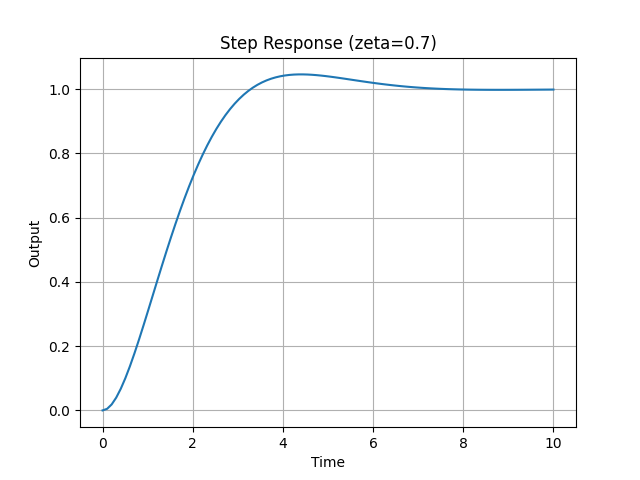
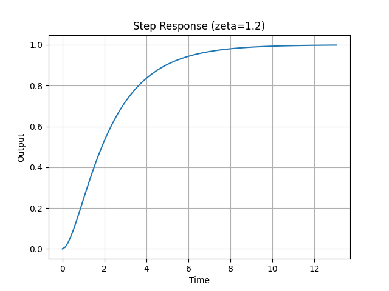
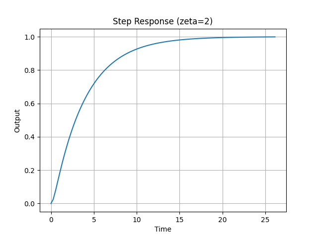
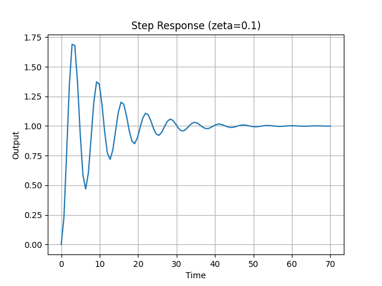

# Control Engineering Log

---

# 📌 2026.03.04 - Damping Ratio Experiment

## 1️⃣ 실험 목적
2차 시스템에서 감쇠비(ζ)가 step response에 미치는 영향을 확인한다.

---

## 2️⃣ 실험 조건

전달함수:

H(s) = ωₙ² / (s² + 2ζωₙs + ωₙ²)

ζ 값:

- 0.1
- 0.3
- 0.7
- 1.2
- 2.0

---

## 3️⃣ 실험 결과 그래프

### ζ = 0.1

### ζ = 0.3

### ζ = 0.7

### ζ = 1.2

---

## 4️⃣ 관찰 결과

- ζ < 1 → 진동 발생 (Underdamped)
- ζ가 작을수록 오버슈트 증가
- ζ ≈ 0.7 → 가장 균형 잡힌 응답
- ζ ≥ 1 → 진동 없음 (Overdamped)
- ζ = 2.0이 1.2보다 더 느리게 수렴

---

## 5️⃣ 해석

감쇠비 ζ는 시스템의 에너지 소모 속도를 결정한다.

- ζ = 0 → 무한 진동
- ζ > 0 → 에너지 감소
- ζ < 0 → 에너지 증가 (불안정)

결론적으로, 제어의 목적은
"빠르면서도 안정한 ζ 값을 찾는 것"이다.